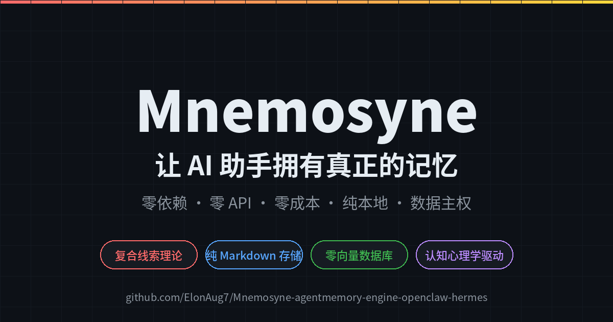
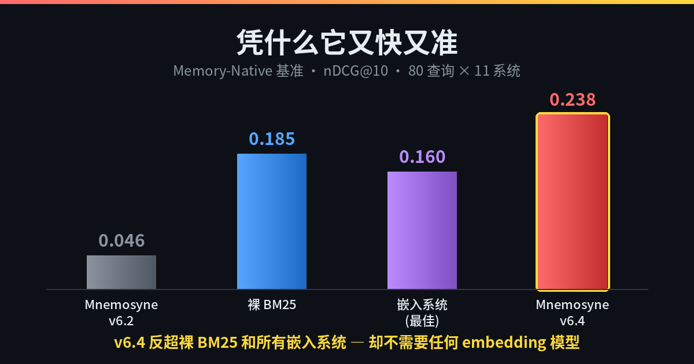
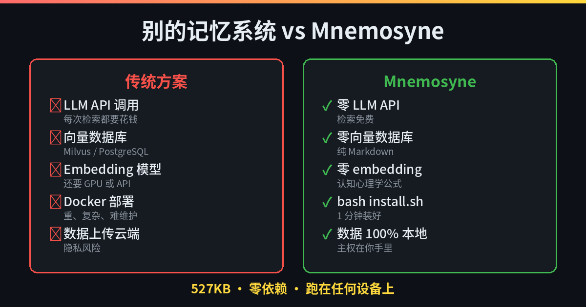
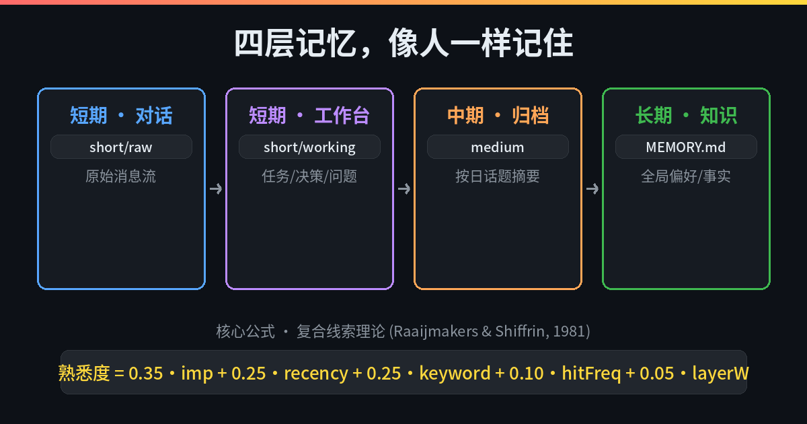

# Mnemosyne — Zero-Dependency Local Memory Engine for agent

## Data Sovereignty by Design

·Not a policy. Not a promise. A property of the architecture.

·527KB. Zero dependencies. Runs anywhere.

·No telemetry. No API keys. No data leaves your machine.

·Every memory is a Markdown file — readable, diffable, yours forever.

·We don't ask for permission to remember your data. We ask for none.

[](LICENSE)


## 💡 What It Is & Where It Fits

Mnemosyne is a **zero-dependency, local-first memory engine** purpose‑built for AI agents. It integrates natively with **OpenClaw**, **Hermes**, and any agentic framework — and runs out‑of‑the‑box on **Windows, Linux, and macOS**.All this, in just **527KB** — small enough to fit on a floppy disk, run on a Raspberry Pi, or embed into any edge device. No cloud, no bloat, just memory.

Wherever you need persistent, sovereign memory without the cloud:
- 🤖 **Agentic workflows** — give your agents long‑term recall without a single API call
- 🧠 **Personal AI assistants** — remember user preferences, conversation history, and past interactions, all stored locally
- 🛠️ **Development tools** — maintain context across multi‑hour coding sessions, even offline
- 📚 **Learning companions** — implement spaced repetition and review schedules, never exposing learner data to third parties

Whether you're deploying on a Windows workstation, a Linux server, or a macOS laptop, Mnemosyne works identically — because memory sovereignty shouldn't depend on your operating system.

## 🎯Why it is special
  Mnemosyne doesn't use neural networks. It uses 140 years of cognitive psychology — from Ebbinghaus' forgetting curve (1885) to SAM compound-cue theory (1981), from the Zeigarnik effect (1927) to TEPA memory revocation (arXiv 2026). Thirty-one papers, ten retrieval factors, all encoded as pure mathematical formulas. It stores like a machine and recalls like a human — without a single API call.
 
  Our compound-cue formula isn't fitted from training data — it's a direct translation of the SAM model into code. Five base weights (imp, recency, keyword, hitFreq, layerW), five cognitive biases (topic coherence, Zeigarnik, Primacy, Context, Testing Boost), and three post-processing filters (superseded, MMR, RIF). Every single factor traces back to a named researcher and a published year. Ask "why 0.35" — the answer is Raaijmakers & Shiffrin, 1981. Not a hyperparameter sweep.
  
  Most AI memory systems are black boxes — feed everything to a large model, let it memorize, let it retrieve. Expensive, slow, and unreliable. We took a different path: 140 years of scientific research on how human memory actually works. We turned psychology formulas into code. No AI models, no API keys — yet the agent remembers like a person. Important things stick. Old memories fade but never disappear. A single keyword triggers entire conversations. That's not artificial intelligence. That's human intelligence, reverse-engineered.

## 🖥️ Demo / Screenshots

<p align="center">
  
</p>

|  |  |
|---|---|
|  |  |

<p align="center">
  
</p>


## Special Thanks
  桦染霜（Tiktok ID）

## ⚡ Quick Start

```bash
git clone https://github.com/ElonAug7/Mnemosyne-agentmemory-engine-openclaw-hermes
cd Mnemosyne-agentmemory-engine-openclaw-hermes/Mnemosyne-v6.4
bash install.sh
open http://localhost:8765
```

## 🚀 Latest: v6.4 — Beats every embedding system, without a single embedding

On our Memory-Native Evaluation benchmark (80 queries, 11 systems including Mem0, LlamaIndex, qwen-agent, Google ADK):

| System | nDCG@10 |
|---|---|
| Mnemosyne v6.2 | 0.046 |
| raw BM25 baseline | 0.185 |
| embedding systems (Mem0 / LlamaIndex / ...) | 0.12–0.16 |
| **Mnemosyne v6.3+** | **0.238** — 5.2× over v6.2, beats everything, pure local keywords |

Search latency: **~7ms** (keyword mode, measured on real data). Target: always < 50ms.

**What's new in v6.4**
- User profile reconstruction — multi-source distillation (decisions, tagged summaries, structured facts) instead of copying files
- True BM25 ranking (v6.3) + weight rebalance: retrieval is decoupled from memory importance
- 8/8 test suite passing · zero-dependency · zero API keys

Full details in `CHANGELOG.md` · install: `cd Mnemosyne-v6.4 && bash install.sh`

## 📊 How It Compares（full documents are in the /docs file）


> 💡 **When to choose Mnemosyne:** You want a memory system that costs nothing to run, keeps all data as human-readable files you can `git diff`, and works entirely offline without any external service dependencies.
>
> ⚠️ **When NOT to choose Mnemosyne:** You need cross-user shared memory at scale, or require deep semantic understanding beyond TF-IDF keyword matching.

If you want you get more information please step to MNEMOSYNE-REFERENCE.md

If you want to get more about the product iteration information please step to CHANGELOG.md

